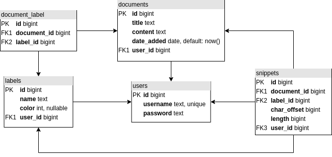

# API & Backend

Using [Hasura](https://hasura.io/docs/latest/index/), creation of both the PostgreSQL database and GraphQL Schema are done automatically through an easy-to-use web UI. An API server can be created quickly using Docker Compose, and all configurations can be depolyed with a few commands.

# Usage

Please make sure `yarn` is installed by running

```
npm install -g yarn
```

Start authentication server locally (run inside the `auth` folder). Note that this service *should* be accessible from within the Hasura Docker container using the `extra_hosts` option added to the compose file, however this has only been tested on linux so far.

```
yarn          # only need to run once or if node_modules folder does not exist
yarn start
```

Start docker containers for Hasura and Postgres (you may need to use `sudo`)

```
docker-compose up -d
```

[Migrations and Metadata](https://hasura.io/docs/latest/migrations-metadata-seeds/index/) for Hasura are stored under the `project` folder and are automatically applied on startup.

Then, to access the Hasura web UI, first [install the Hasura CLI](https://hasura.io/docs/latest/hasura-cli/install-hasura-cli/) and then, inside the `project` folder, run

```
hasura console
```

You may need to wait for the Docker container to finish starting.

## Note

The reason the web UI should always be accessed through `hasura console` rather than using the endpoint directly is so that all migrations are saved for any changes you may have made within Hasura that you want pushed to version control. If the web endpoint is accessed directly, these migrations may not be properly tracked.

# DB Schema Diagram



# User System

To authenticate users, we can take advantage of [webhooks for Hasura](https://hasura.io/docs/latest/auth/authentication/webhook/). This involves creating a REST API that interfaces with Hasura automatically according to their specification. For this project, the [GET Request](https://hasura.io/docs/latest/auth/authentication/webhook/#get-request) pattern is used.

Hasura forwards certain headers, including `Authorization`, to the webhook, and the webhook then processes the request and responds with the user ID and the roles that have been assigned to the user (assuming their credentials are valid). If no `Authorization` header is present, then the webhook responds with the `public` role. The role is sent in the response body under the JSON property `X-Hasura-Role`. For more information about Hasura roles and user IDs, see [here](https://hasura.io/docs/latest/auth/authorization/roles-variables/).

Source code for the webhook API can be found in the `auth/` folder.

## Roles and Permissions

You can view roles/permission under the `Permissions` tab for any database table or Hasura Action.

### `public`

The `public` role is for unauthenticated users and serves the sole purpose of allowing user registration. This role has no access to any operations on any table except for the ability to use the `select` operation on the `users` table (specifically only for the `users.username` field) in order to let clients know if the username they request is already taken.

This role also has exclusive access to the `register_new_user` mutation detailed in the [Registration](#registration) section.

### `user`

This role is for users with valid credentials. Permissions for users are more complex and are table-specific, but in general, users are allowed to use `select`, `insert`, `update`, and `delete` on any rows for which the `user_id` column matches the `X-Hasura-User-Id` property sent by the auth webhook. Users generally cannot modify database ids or generated fields (such as `time_added`), but can `select` all columns for rows that they own.

Many-to-many tables require more advanced permissions. For example, the permissions for `document_label` employ extra checks to ensure the user owns both the document and label specified by `document_id` and `label_id`.

## Authentication Scheme

The webhook uses the [HTTP Basic](https://en.wikipedia.org/wiki/Basic_access_authentication#Client_side) authentication scheme, in which the user's username/password is included in an HTTP header.

### Important Note

To test the functionality of the `user` role from within the Hasura Console, uncheck the `x-hasura-admin-secret` request header and add an `Authorization` header with the user's credentials formatted according to the HTTP Basic authentication scheme.

## Registration

### REST Handler

To register new users, the authentication webhook also includes the `POST /register` handler, which requires the username and password to be provided in the request body. After verifying that the requested username is not already taken, and after encrypting the password, the new user's information is stored and the handler responds with the new user ID and username.

### Hasura Action

The registration endpoint is exposed as a [Hasura Action](https://hasura.io/docs/latest/actions/index/) so that frontend developers can continue to use GraphQL only. The `register_new_user` mutation takes a username and password and returns the user ID and username after the user is successfully created. The action communicates with the REST endpoint, so there is no need for the REST API to be exposed to clients.

NOTE: The only role that has access to this endpoint is the `public` role, since existing users will not be performing user registration.

## Developer Notes

In order to keep all database access controlled through one service, the webhook API actually communicates with Hasura's GraphQL endpoint (using the admin secret) for all database operations. This decision was made to limit how many services have direct access to the database and prevent multiple points of failure. This also encourages the Hasura server and the auth server to be run in the same LAN so admin secrets are only passed internally and so that the auth server never needs to be exposed externally.

Also, since the auth API uses the same `.env` file as the Docker Compose file, if the auth API is built as a Docker image, it can be easily included in the Compose file and can leverage Docker Networking for security.

# queries.gql

The `queries.gql` file contains example queries for more complex operations.

# Python client

It is possible to interact with the Hasura GraphQL Engine via a Python client. Hasura's GitHub recommends using `sgqlc` which can be installed via `pip install sgqlc`. Once sgqlc is installed, run `demos/demo_python_client.py` which shows how to call Hasura via Python. Note the example uses hand-written GraphQL queries; sgqlc has some function to make this easier w/ Python classes also if you want.