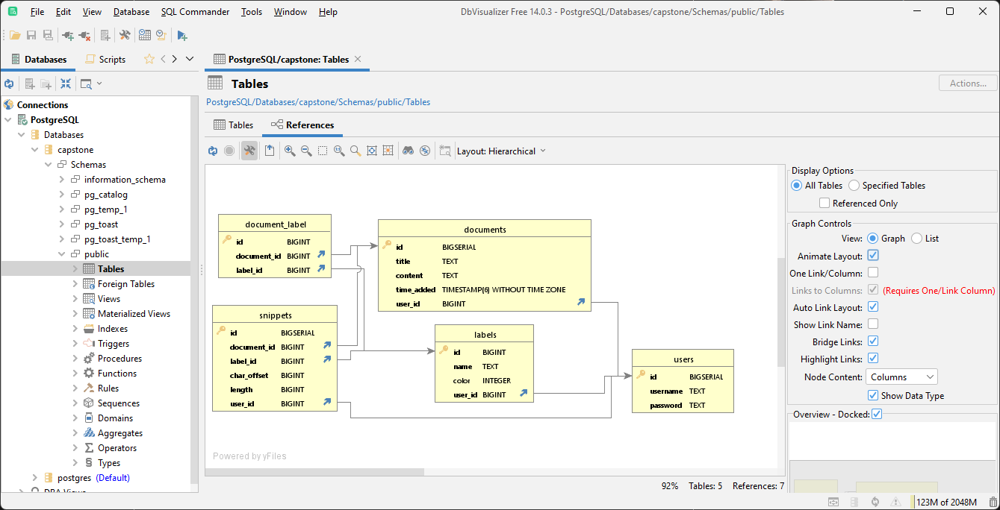

# Generating DB Diagrams

A really easy way to do this is through the use of the program [DbVisualizer](dbvis.com). Install DbVisualizer from their website to use it.

## Before you can use DbVisualizer

You must ensure that your local Postgres instance is listening on port `5432`. The override file, `docker-compose.exposed.yaml`, opens the Postgres container on this port.

To run the backend with Postgres open, use the command

```
docker-compose -f docker-compose.yaml -f docker-compose.override.yaml -f docker-compose.exposed.yaml up -d
```

## Connect to the database using DbVisualizer

### Import settings

The `settings.jar` file (in the `docs` folder) contains pre-configured settings for the Postgres connection. Import it using `File > Import Settings...`

### Manually

Add a PostgreSQL database connection, enter the credentials from the `.env` file, and connect to the local Postgres instance.

## View a diagram

- In the left-hand pane, go to `Connections > PostgreSQL > Databases > capstone > Schemas > public > Tables`.
- Double-click on `Tables` to open it as an object.
- In the main pane, select the `References` tab to see a schema diagram.

Example:

